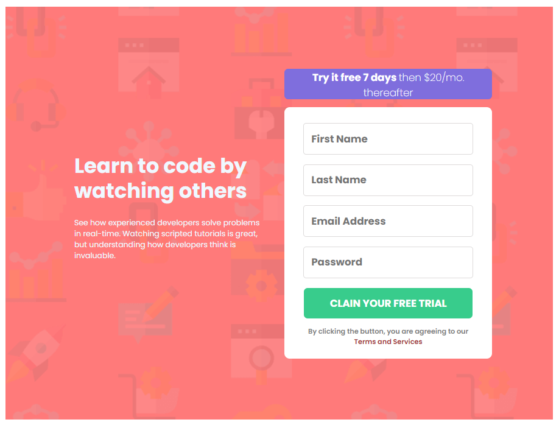
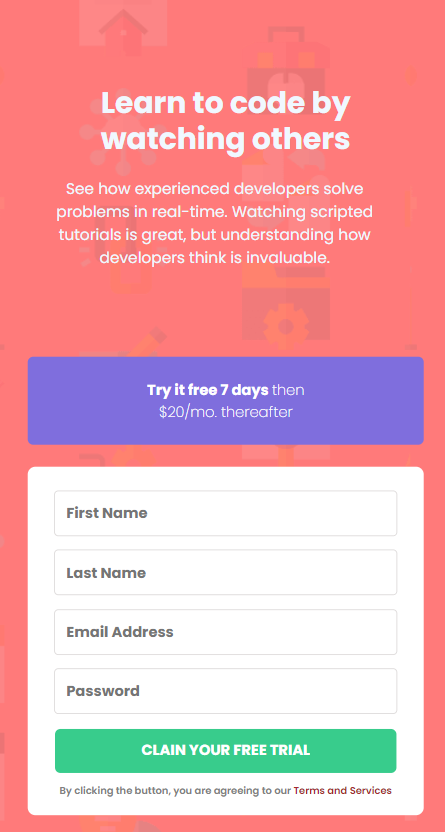

# Frontend Mentor - Intro component with sign up form solution

This is a solution to the [Intro component with sign up form challenge on Frontend Mentor](https://www.frontendmentor.io/challenges/intro-component-with-signup-form-5cf91bd49edda32581d28fd1). Frontend Mentor challenges help you improve your coding skills by building realistic projects. 

## Table of contents

- [Overview](#overview)
  - [The challenge](#the-challenge)
  - [Screenshot](#screenshot)
- [My process](#my-process)
  - [Built with](#built-with)
  - [What I learned](#what-i-learned)
  - [Continued development](#continued-development)
- [Author](#author)

## Overview

### The challenge

Este é um desafio feito pelo App FrontEndMentor para ajudar novos e antigos desenvolvedores a progredirem em suas habilidades de programação, raciocinio e visual. Capacitando-os a trabalhar diretamente com o estilo exigido pelo mercado de trabalho.

This is a challenge made by App FrontEndMentor to help new and old developers progress in their programming, reasoning and visual skills. Enabling them to work directly with the style required by the job market.

### Screenshot

## My process

### Built with

- Semantic HTML5 markup
- CSS custom properties
- Mobile-first workflow
-JavaScript

### What I learned

 Aprendi a controlar um pouco mais os elementos pais e filhos do CSS como o casamento de padding, heigth e margins de forma mais adequada. Estou aprendendo a utilizar o flex-box para ajustar os elementos. Aprendi a olhar a imagens e distinguir os elementos de sua criação. 
 Principalmente, aprendi a desenvolver mais em javascript.

I learned to use Display Grid a little more. I learned to control CSS parent and child elements a little more, such as matching padding, height and margins more appropriately. I'm learning how to use flex-box to adjust elements. I learned to look at images and distinguish the elements of their creation.
Mainly, I learned to develop more in JavaScript.

### Continued development

Continuarei a desenvolver em futuros projetos os dados aprendidos acima. Para fixa-los em minha mente e torna-los naturais.

I will continue to develop the data learned above in future projects. To fix them in my mind and make them natural.

## Author

- Git - [TigoP](https://github.com/TigoP)
- Frontend Mentor - [@TigoP](https://www.frontendmentor.io/profile/TigoP)
- LinkedIn - [@tiago-pereira-n](https://www.linkedin.com/in/tiago-pereira-n/)
